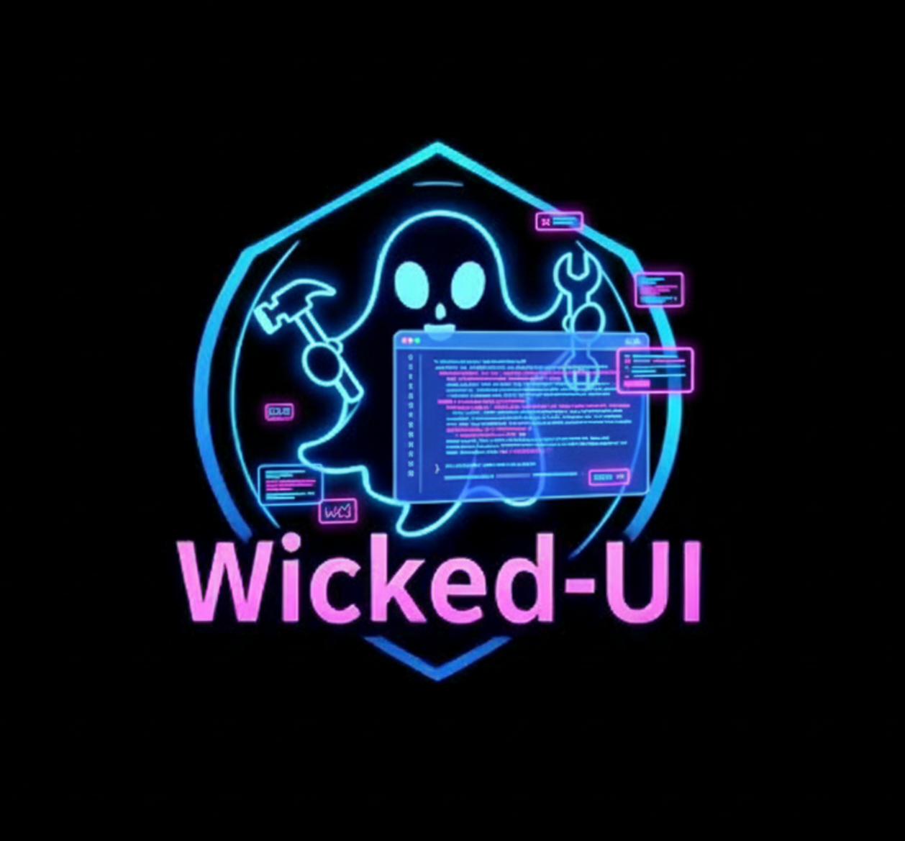

<div align="center">
  <h1>📧 WickedUI Email Outreach</h1>
  <p>A powerful AI-powered email automation tool by <a href="https://wicked-ui.com" target="_blank">WickedUI</a></p>
  <p>Find companies using natural language and send them personalized emails at scale.</p>
    

</div>

## 🔥 WickedUI Pro Features

This open-source version is brought to you by WickedUI. For advanced features and enterprise support, check out our [WickedUI Pro](https://wicked-ui.com/pro) offering that includes:
- Advanced AI personalization
- Email sequence automation
- Detailed analytics & tracking
- Team collaboration tools
- Priority support

## 🚀 About This Tool

A Python-based email automation solution that leverages Google's Gemini AI to find companies and send them personalized emails. Perfect for sales outreach, partnerships, and business development.

## ✨ Features

- **AI-Powered Company Search**: Find companies using natural language queries
- **Bulk Email Sending**: Send personalized emails to multiple recipients
- **Template-Based**: Customize email subjects and bodies using templates
- **CSV Integration**: Save and manage company data in CSV format
- **Secure Authentication**: Uses environment variables for sensitive information
- **SMTP Support**: Compatible with major email providers (Gmail, Outlook, etc.)

## 🚀 Quick Start

### Prerequisites

- Python 3.8 or higher
- pip (Python package manager)
- Google Gemini API key
- Email account with SMTP access

### Installation

1. **Clone the repository** (if you haven't already):
   ```bash
   git clone <repository-url>
   cd email-sender
   ```

2. **Set up a virtual environment** (recommended):
   ```bash
   python -m venv .venv
   source .venv/bin/activate  # On Windows: .venv\Scripts\activate
   ```

3. **Install dependencies**:
   ```bash
   pip install -r requirements.txt
   ```

4. **Configure your environment**:
   - Create a `.env` file in the project root
   - Add your credentials:
     ```
     # Email configuration
     EMAIL_ADDRESS=your.email@example.com
     EMAIL_PASSWORD=your_app_password
     SMTP_SERVER=smtp.gmail.com
     SMTP_PORT=587
     
     # Gemini API
     GEMINI_API_KEY=your_gemini_api_key
     ```

## 🛠️ Usage

### 1. Find Companies

Search for companies using a natural language query:

```bash
python main.py --search "AI companies in New York" --max-results 5
```

This will:
1. Search for companies matching your query
2. Save their information to `recipients.csv`
3. Show a summary of the found companies

### 2. Review Recipients

Before sending emails, review the generated `recipients.csv` file:

```bash
cat recipients.csv
```

### 3. Send Emails

To send emails to the recipients:

```bash
python main.py --send
```

The script will:
1. Load recipients from `recipients.csv`
2. Ask for confirmation before sending
3. Send emails with a 2-second delay between each

## 📝 Customization

### Email Templates

Edit `template.py` to customize your email content:

```python
# Subject template with placeholders
SUBJECT_TEMPLATE = "Unlock Your Business Potential with AI & Automation"

# Email body template with placeholders
EMAIL_BODY = """\
Dear {name},

I hope this message finds you well. My name is Stephen Prahl, and I'm a Software & AI Engineer...

Best regards,
Stephen Prahl
WickedUI
"""
```

### Company Search

Customize the search query to find specific types of companies:

```bash
# Example searches
python main.py --search "solar panel installation companies in California"
python main.py --search "tech startups in Berlin"
python main.py --search "marketing agencies in London" --max-results 10
```

## 🔒 Security

- **Never commit sensitive information** to version control
- Use **App Passwords** instead of your main email password
- The `.env` file is included in `.gitignore` by default
## ⚠️ Important Notes

1. **Email Limits**: Be aware of your email provider's sending limits
2. **API Quotas**: The Gemini API has rate limits
3. **Legal Compliance**: Ensure compliance with data protection regulations
4. **Testing**: Always test with a small batch before sending to many recipients

## 🔒 Security

- **Never commit sensitive information** to version control
- Use environment variables for API keys and credentials
- Review email content before sending
- Be mindful of email sending limits to avoid being flagged as spam

## 📄 License

This project is open source and available under the [MIT License](LICENSE).

## 🏢 About WickedUI

WickedUI builds powerful developer tools and AI solutions to help businesses grow. Our mission is to simplify complex workflows through intuitive software.

- 🌐 [wicked-ui.com](https://wicked-ui.com)
- 🐦 [@WickedUI](https://twitter.com/wickedui)
- 💼 [LinkedIn](https://linkedin.com/company/wickedui)

---

<div align="center">
  <p>Built with ❤️ by the <a href="https://wicked-ui.com" target="_blank">WickedUI</a> team</p>
  <p>Part of the WickedUI Open Source Initiative</p>
  <p>
    <a href="https://wicked-ui.com" target="_blank">Website</a> • 
    <a href="https://github.com/wickedui" target="_blank">GitHub</a> • 
    <a href="https://twitter.com/wickedui" target="_blank">Twitter</a>
  </p>
</div>
